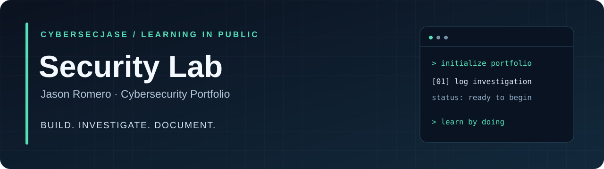

**Hands-on practice. Clear evidence. Continuous learning.**

[Start Here](labs/01-authentication-log-investigation/README.md) &nbsp; • &nbsp; [Lab Index](#lab-index) &nbsp; • &nbsp; [Learning Roadmap](#learning-roadmap) &nbsp; • &nbsp; [GitHub Profile](https://github.com/CyberSecJase)

---

## Welcome to my lab

I'm **Jason Romero**, starting my hands-on cybersecurity journey. This portfolio is where I'll document the labs I work through, the problems I investigate, and what I learn along the way.

My learning goals include **Linux**, **network analysis**, and **security monitoring**, with Wireshark, Nmap, and Splunk on the roadmap.

> **Current focus:** My first authentication-log investigation.  
> **Progress:** Portfolio set up · First exercise ready · 0 labs completed

## Lab index

| Lab | What I'll practice | Tools | Progress |
| --- | --- | --- | --- |
| **[01 · Authentication Log Investigation](labs/01-authentication-log-investigation/README.md)** | Find suspicious login patterns, reconstruct timelines, and explain the evidence | PowerShell · CSV | 🟡 Ready to start |

### Start with Lab 01

Review a fictional set of login events and answer a practical question: **which activity deserves a closer look, and why?**

The lab includes a sample dataset, step-by-step commands, investigation questions, and reference answers to check after writing my own findings.

**[Open the lab guide →](labs/01-authentication-log-investigation/README.md)**

## What you'll find in a completed lab

| Part | What it shows |
| --- | --- |
| **Objective & setup** | The problem, tools, and environment |
| **Investigation** | Steps taken and the reasoning behind them |
| **Evidence** | Screenshots, commands, or output supporting the findings |
| **Reflection** | What worked, what failed, and what I learned |

Personal reports and evidence will be added as I complete each exercise. Supplied practice material is labeled separately from my own findings.

## Learning roadmap

These are planned topics, not completed projects.

- [ ] **Log analysis** — complete Lab 01 and publish my investigation report
- [ ] **Linux foundations** — users, groups, permissions, and log navigation
- [ ] **Wireshark** — inspect DNS and TCP traffic from an owned lab device
- [ ] **Nmap** — inventory services on an owned, isolated virtual machine
- [ ] **Splunk** — import lab logs and document useful searches

## My lab workflow

**Learn → Run → Investigate → Capture evidence → Write up → Improve**

1. Follow the lab guide and record the steps I actually perform.
2. Copy the [report template](templates/lab-report.md) into the lab folder as `REPORT.md`.
3. Add my findings and use the [evidence checklist](EVIDENCE.md).
4. Link the finished report above and update its progress.

---

Practice uses synthetic data or systems owned or explicitly authorized for testing. This starter portfolio and exercise were prepared with AI assistance. Future reports will distinguish my own work and evidence from supplied examples.
